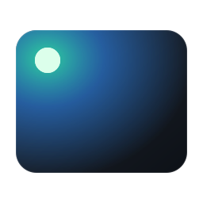
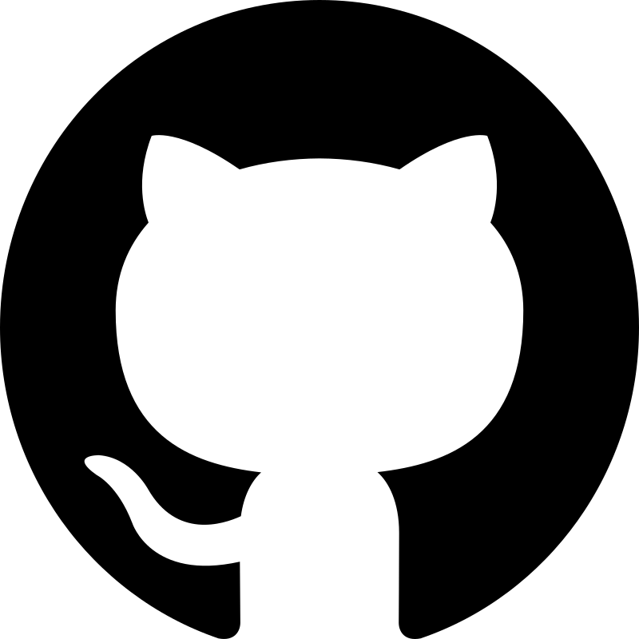
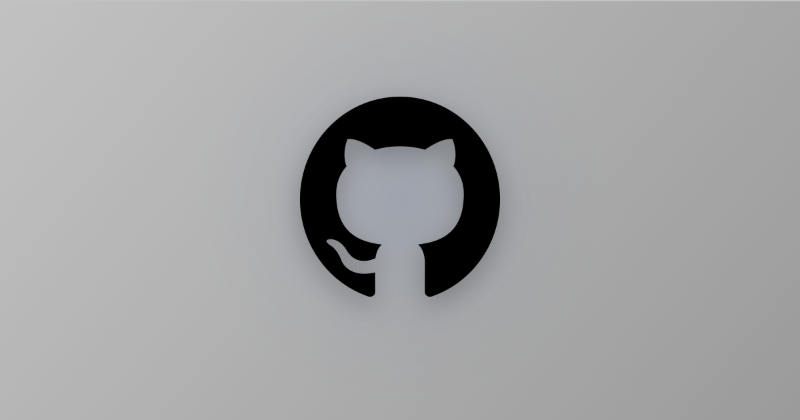

<p align="center">
  
</p>

<h1 align="center">cardglow</h1>

<p align="center">
  Turn any logo — PNG, GIF, or SVG, square or rectangular — into a clean,
  <a href="https://opengraph.githubassets.com">GitHub-OG-card</a>-style social preview image.
</p>

<p align="center">
  <a href="LICENSE"></a>
  
</p>

Point it at a logo and get back a ready-to-use `og:image` / Twitter
card PNG, with **zero manual color picking**: cardglow auto-detects the
logo's dominant color and tints the background glow to match.

## See it in action

### Before

<p align="center">
  
</p>

```bash
./cardglow-docker.sh docs/input.svg --gradient-angle 130 --bg-top ffffff --bg-bottom cccccc --icon-size 300 -o docs/example.png
```

### After

<p align="center">
  
</p>

## Features

- **PNG / GIF / SVG input** — SVGs are rasterized at high resolution with their aspect ratio preserved; GIFs use the first frame.
- **Auto-crop** — trims transparent margins so off-center or padded source art gets re-centered correctly.
- **Precise layout control** — CSS-style `--padding`, `--fit` (contain / cover / width / height) and `--align`, so you can say "fill the full height, 10px from the top and bottom" and get exactly that.
- **Auto background removal** — optionally strip a flat/near-uniform background (e.g. a product photo on white) before compositing, so it doesn't clash with the card's own background.
- **Auto color-matched glow** — samples the logo's dominant color, no manual hex-picking needed (or override with `--glow`).
- **Watermark & provenance metadata** — stamp a corner or full-page tiled text watermark, and embed author / copyright / custom fields in the file itself.
- **Angled gradient background** — CSS `linear-gradient()`-style `--gradient-angle`, dithered to avoid banding on narrow color ranges.
- **Subtle dot grid, vignette, drop shadow** — the same details that make GitHub's own OG cards feel polished.
- **No local installs** — ships as a Docker image; only dependency on your machine is Docker itself.

## Quick start

```bash
docker run --rm -v "$PWD":/data ghcr.io/alan-null/cardglow logo.png
```

That writes `logo-og.png` (1200×630) next to your source file.

Or grab the wrapper script for a shorter command:

```bash
curl -O https://raw.githubusercontent.com/alan-null/cardglow/main/cardglow-docker.sh
chmod +x cardglow-docker.sh
./cardglow-docker.sh logo.png
```

## Usage

```
cardglow <input> [options]

  -o, --output PATH       Output PNG path (default: <input>-og.png)
  --size WxH              Canvas size (default: 1200x630)
  --icon-size PX          Cap the logo's longest side in px
                          (default: 300, unless --padding/--fit is used)
  --padding CSS           Inset from the canvas edges, CSS shorthand:
                          "10", "10 20", "10 20 30", "10 20 30 40"
                          (top right bottom left). Defines the content box.
  --fit MODE              How the logo fills the content box:
                          contain (default, never overflows),
                          height  (fill the full height),
                          width   (fill the full width),
                          cover   (fill both axes, cropping the overflow)
  --align POS             Placement inside the content box: center (default),
                          top, bottom, left, right, top-left, top-right,
                          bottom-left, bottom-right
  --bg-top HEX            Top gradient color (default: 0d1117)
  --bg-bottom HEX         Bottom gradient color (default: 090b0f)
  --gradient-angle DEG    Gradient direction, CSS linear-gradient() style:
                          0=to top, 90=to right, 180=to bottom (default),
                          270=to left. Try 135 for a GitHub-style diagonal.
  --glow HEX              Force glow color (default: auto-detected)
  --no-grid               Disable the dot-grid background
  --no-vignette           Disable the corner vignette
  --no-autocrop           Skip auto-cropping transparent margins
  --transparent           Output the processed logo on a transparent canvas
                          instead of an OG card (PNG/WebP only)
  --no-dither             Disable gradient dithering
  --dither-strength FLOAT Dither noise amplitude (default: 1.0)
  --svg-render-px PX      Minimum SVG rasterization size, longest side
                          (default: 1000, auto-raised for large canvases)
  --remove-bg             Auto-remove a flat/near-uniform background,
                          sampled from the image corners, before compositing
  --bg-tolerance FLOAT    Color-distance tolerance for --remove-bg
                          (default: 30). Higher removes more shades/noise.
  --bg-feather FLOAT      Edge feather radius in px for --remove-bg
                          (default: 2.0, 0 disables softening)
  --watermark TEXT        Draw TEXT as a semi-transparent watermark
  --watermark-position P  Where it sits: center, top, bottom, left, right,
                          top-left, top-right, bottom-left,
                          bottom-right (default)
  --watermark-opacity F   Opacity 0-1 (default: 0.35)
  --watermark-size PX     Font size (default: ~2.8% of canvas height)
  --watermark-color HEX   Text color (default: ffffff)
  --watermark-margin PX   Inset from the edges (default: ~2.5% of height)
  --watermark-tile        Repeat the watermark diagonally across the image
  --watermark-angle DEG   Rotation of the tiled watermark (default: 30)
  --author NAME           Embed an author/creator name in the metadata
  --copyright TEXT        Embed a copyright notice in the metadata
  --description TEXT      Embed a description in the metadata
  --metadata KEY=VALUE    Embed an extra metadata field (repeatable)
  --no-metadata           Write no metadata at all
```

### Protecting your assets

cardglow can mark an image two ways — visibly and invisibly — and they are
meant to be used together:

```bash
# Discreet corner credit
./cardglow-docker.sh logo.png --watermark "example.com"

# Hard-to-crop tiled watermark for previews/proofs
./cardglow-docker.sh logo.png --watermark "ACME — PREVIEW" --watermark-tile --watermark-opacity 0.10

# Ownership info embedded in the file
./cardglow-docker.sh logo.png --author "ACME Ltd" --copyright "(c) 2026 ACME" --metadata "License=CC-BY-4.0"
```

How the metadata is stored per format:

| Format      | Storage       | Fields                                                                                               |
| ----------- | ------------- | ---------------------------------------------------------------------------------------------------- |
| PNG         | `tEXt` chunks | one chunk per key (`Software`, `Author`, `Copyright`, `Description`, plus your own)                  |
| JPEG / WebP | EXIF          | `Software`, `Artist`, `Copyright`; anything else is folded into `ImageDescription` as `Key=Value; …` |

Every output carries `Software=cardglow` by default; pass `--no-metadata` to
strip that too.

> **Caveat:** metadata is *attribution*, not protection — most social platforms
> re-encode uploads and drop EXIF/`tEXt` chunks, and anyone can strip it with
> one command. A visible watermark (ideally `--watermark-tile`) is the only
> part that survives a re-upload or a screenshot.

### Sizing and positioning

The layout is a simple box model, the same one CSS uses:

1. The **content box** is the canvas minus `--padding`.
2. `--fit` decides how the logo is scaled into that box.
3. `--align` decides where it sits inside it.
4. `--icon-size` optionally caps the result, so a logo never grows past a
   given size even if the box would allow it.

So "position this icon on a 600×420 canvas, filling the full height, leaving
10px at the top and bottom" is:

```bash
./cardglow-docker.sh icon.svg --size 600x420 --padding 10 --fit height --transparent
```

The rendered logo is exactly 400px tall and starts exactly 10px from the top.
Note that `--fit height` may overflow horizontally on wide logos — use
`--fit contain` if you need it to stay inside the box on both axes.

> **Note:** when `--padding` or `--fit` is used, cardglow places the logo at the
> exact coordinates you asked for. Without them it applies a small upward
> optical nudge (~3% of the canvas height), which is what makes the default
> card look balanced.

### Examples

```bash
# Basic
./cardglow-docker.sh logo.png

# SVG source, custom output name
./cardglow-docker.sh logo.svg -o card.png

# GitHub-style diagonal gradient
./cardglow-docker.sh logo.png --gradient-angle 135

# Force a specific glow color, drop the dot grid
./cardglow-docker.sh logo.png --glow "#ff3355" --no-grid

# Larger logo, custom canvas size
./cardglow-docker.sh logo.png --icon-size 400 --size 1280x640

# Fill the full canvas height, 10px clear of the top and bottom edges
./cardglow-docker.sh logo.svg --size 600x420 --padding 10 --fit height

# Wide margins, logo tucked into the bottom-right corner
./cardglow-docker.sh logo.png --padding "40 80" --align bottom-right

# Fill the whole canvas, cropping whatever overflows
./cardglow-docker.sh logo.png --size 600x420 --fit cover

# Product photo on a plain background — strip it before compositing
./cardglow-docker.sh photo.png --remove-bg

# Remove a flat background and create a transparent 600x600 WebP cutout
./cardglow-docker.sh photo.png --remove-bg --transparent --size 600x600 --icon-size 600 -o cutout.webp

# Corner watermark plus embedded ownership info
./cardglow-docker.sh logo.png --watermark "example.com" --author "ACME Ltd" --copyright "(c) 2026 ACME"

# Faint tiled watermark across the whole card
./cardglow-docker.sh logo.png --watermark "ACME — PREVIEW" --watermark-tile --watermark-opacity 0.10
```

## Notes on SVG input

SVGs are rasterized before compositing, so the raster resolution matters:

- The **aspect ratio is always preserved** — cardglow rasterizes one axis and
  lets the renderer derive the other from the source `viewBox`. A 4:1 banner
  logo stays 4:1.
- `--svg-render-px` is a **minimum**, not a fixed size. It is automatically
  raised to roughly 2× the size the logo will actually be drawn at (capped at
  4096px), so large canvases stay crisp without you having to tune it.
- An SVG with **no `viewBox` and no intrinsic `width`/`height`** has no aspect
  ratio for the renderer to work from and may rasterize at an unexpected size.
  If your output looks wrong, add a `viewBox` to the source SVG.
- Rasterization still happens *before* scaling, so an SVG is not infinitely
  resolution-independent here. For very large output, raise `--svg-render-px`.

## Building locally

```bash
git clone https://github.com/alan-null/cardglow.git
cd cardglow
docker build -t cardglow .
docker run --rm -v "$PWD":/data cardglow logo.png
```

## Running without Docker

If you'd rather run it directly:

```bash
pip install pillow cairosvg numpy
python3 cardglow.py logo.png
```